# Apache Airflow — A Practical Training Guide

> **Who this is for:** anyone starting out with Airflow, **including people who have never
> worked in data before**. No data-engineering background is assumed. No Airflow knowledge is
> assumed. If you can read a little Python, that is plenty — and §0 below explains every term
> you will need before it is used.
>
> **What it covers:** why this kind of tool exists at all, what Airflow is, how every part of
> it works and how they fit together, how a job actually flows through the system, where
> Airflow is a great fit and where it is the wrong tool, and how to turn the script already
> sitting in this repository into a real Airflow workflow.
>
> **Version:** written against **Apache Airflow 3.x**. Airflow 3 changed the architecture in
> ways that matter, so much of what you find about Airflow 2 online is subtly wrong today.
> Where the two differ, this guide says so explicitly, and §16 is a 2→3 cheat sheet.
> Every factual claim was checked against the Airflow 3.3.1 documentation in September 2026.

---

## 0. Before you start

### 0.1 You are not expected to read this end to end

This document has two jobs: get you productive in week one, and still be useful in month
twelve. Those need different amounts of detail, so the deeper material is **marked and safe
to skip**. Watch for these two markers:

> 🔧 **Engineer depth.** Skip on a first read. Useful once you are running Airflow yourself;
> skipping it will not stop you understanding anything later in the document.

> 💡 **Plain English.** A short translation of the jargon just used.

**Where to start, depending on who you are:**

| If you are... | Read | Skip for now |
|---|---|---|
| **Completely new to data** — first job, or moving from another field | §0, §1, §2, §3, §6, §12, §13 | §4.4–4.6, §7, §9–§11, §14–§16 |
| A developer, new to data work | Add §4.1–4.3, §5, §8, §9 | §4.6, §15.4, §16 |
| A developer who will run or deploy Airflow | Everything | — |
| A manager or analyst who just needs the idea | §1, §2.1–2.2, §12, §13 | Everything else |

If you are in the first row: **§1, §2, §3, §6, §12 and §13 are written for you specifically.**
They contain no code you need to understand. That is roughly a third of the document, and it
is enough to hold a sensible conversation about Airflow in your first week.

### 0.2 The words you need first

Every term below is used in this document and assumed elsewhere on the internet. None of them
are difficult; they are just unfamiliar. Read this table once and come back to it.

| Word | What it actually means |
|---|---|
| **Data pipeline** | A series of steps that moves data from where it is created to where someone can use it. "Fetch yesterday's sales from the website, tidy them up, put them in the reporting system" is a pipeline. |
| **Job** / **script** | One program that does one piece of work and then stops. `video_stats.py` in this repository is a script. |
| **Production** | The real, live system that the business depends on — as opposed to your laptop. "In production" means "for real, where it matters if it breaks." |
| **API** | A way for one program to ask another program for information over the internet. This repository asks YouTube's API for video statistics. |
| **Data warehouse** | A large database built for *analysis and reporting* rather than for running an app. Snowflake and BigQuery are two popular ones. When this document says "the warehouse," it means "the big central database the reports are built on." |
| **Batch** vs **streaming** | **Batch** = collect data and process it in chunks, usually on a schedule ("every night at 3 AM"). **Streaming** = process each item the instant it arrives. Airflow is a batch tool. |
| **ETL** / **ELT** | Extract, Transform, Load — the three classic stages of a data pipeline. ELT is the same three stages in a different order (transform *after* loading). This repository is the "E" — it extracts. |
| **Orchestration** | Deciding what runs, when, in what order, and what to do when something fails. This is Airflow's entire job. |
| **Dependency** | "B cannot start until A has finished." Most of what Airflow does is track and enforce dependencies. |
| **cron** | The decades-old Unix tool that runs a command on a schedule. It does one thing well and nothing else — §1 is largely about why that is not enough. |
| **Idempotent** | A step you can safely run twice and get the same result, rather than doubled or corrupted data. Think of a light switch set to "on" — flicking it to "on" again changes nothing. This turns out to be the single most important discipline in the whole field. |
| **Backfill** | Deliberately re-running a pipeline over past dates — because the data was wrong, or because you just built the pipeline and want last year's numbers too. |

You will meet roughly ten more Airflow-specific words in §3. Those are Airflow's own
vocabulary and are introduced properly there. There is also a full glossary in §17.1.

---

## Table of contents

🟢 = no background needed  🟡 = some code-reading helps  🔧 = for engineers running Airflow

| # | Section | Level | Why you care |
|---|---------|-------|--------------|
| 0 | [Before you start](#0-before-you-start) | 🟢 | How to read this, and the words you need first |
| 1 | [The problem Airflow solves](#1-the-problem-airflow-solves) | 🟢 | Start here — uses this repo's own script |
| 2 | [What Airflow is, and is not](#2-what-airflow-is--and-what-it-is-not) | 🟢 | Avoids the #1 misconception |
| 3 | [The vocabulary](#3-the-vocabulary) | 🟢 | You cannot read Airflow docs without it |
| 4 | [Architecture: the components](#4-architecture-the-components) | 🟡🔧 | The core of this guide. §4.1–4.3 are 🟡, §4.4–4.6 are 🔧 |
| 5 | [How a run actually happens](#5-how-a-run-actually-happens-end-to-end) | 🟡 | End-to-end trace |
| 6 | [The task lifecycle](#6-the-task-lifecycle) | 🟢 | What every colour in the UI means |
| 7 | [Executors: where your code runs](#7-executors-where-your-code-runs) | 🔧 | Biggest deployment decision |
| 8 | [The scheduling model](#8-the-scheduling-model-the-part-everyone-gets-wrong) | 🟡 | The part everyone gets wrong |
| 9 | [Turning THIS repo into a DAG](#9-turning-this-repo-into-a-dag) | 🟡 | Hands-on, with working code |
| 10 | [Passing data between tasks](#10-passing-data-between-tasks-xcom) | 🟡 | XCom and its traps |
| 11 | [Connections, Variables, Pools](#11-connections-variables-and-pools) | 🟡 | Stop hardcoding secrets |
| 12 | [Business use cases](#12-business-use-cases) | 🟢 | How to pitch it to a stakeholder |
| 13 | [Pros, cons, when not to use it](#13-pros-cons-and-when-not-to-use-airflow) | 🟢 | Honest assessment |
| 14 | [Mistakes new joiners make](#14-mistakes-new-joiners-make) | 🟡 | Read before your first pull request |
| 15 | [Running Airflow locally](#15-running-airflow-locally) | 🔧 | Including this repo's Dockerfile |
| 16 | [Airflow 2 → 3 cheat sheet](#16-airflow-2--3-cheat-sheet) | 🔧 | Only if you have prior Airflow experience |
| 17 | [Glossary and further reading](#17-glossary-and-further-reading) | 🟢 | Reference |

---

## 1. The problem Airflow solves

### 1.1 Start with the script we already have

This repository contains `video_stats.py`. It does four things, in order:

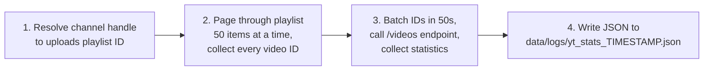

It is a perfectly good script. It handles pagination, batches its API calls, logs progress,
and raises on HTTP errors. Run it by hand and it works.

Now let us put it into production. The naive answer is "schedule it with cron, or Windows
Task Scheduler, at 3 AM daily." Here is what the next six months look like.

### 1.2 What actually goes wrong

| Month | What happened | What cron gave you |
|-------|---------------|--------------------|
| 1 | Ran fine | Nothing to do |
| 1 | Your manager asks "did it run last Tuesday?" | Grep a log file on a server, if it still exists |
| 2 | YouTube returns HTTP 403 quota-exceeded on batch 7 of 9 | The whole script dies. Steps 1–2 are redone tomorrow from scratch, burning quota again |
| 2 | You want to retry just the failed step | Impossible — the script is one process |
| 3 | Network blip; you want 3 retries with 5-minute backoff | You hand-write retry logic, in every script |
| 3 | A second pipeline needs the video IDs step 2 produces | You copy-paste steps 1–2 into another script |
| 4 | The run hangs for 9 hours holding the API key | No timeout, no alert, nobody noticed |
| 4 | Two runs overlap after a slow night | Duplicate files, doubled quota consumption |
| 5 | Someone needs the last 30 days re-extracted | You write a bash loop and pray |
| 5 | The API key must rotate | It lives in a `.env` on one laptop |
| 6 | A new joiner asks "what feeds the dashboard?" | Tribal knowledge |

None of these are exotic. Every one shows up on every data team, on every pipeline, within
the first year. Cron solves exactly one problem — *start this process at this time* — and
leaves every other problem on that list to you.

### 1.3 The gap, stated plainly

What you actually need is a system that can handle:

- **Ordering** — run B only after A succeeds, and C only after both A and B.
- **Retries** — retry one step 3 times with backoff, without redoing the whole job.
- **Idempotency and re-runs** — re-run "3rd September" without touching any other day.
- **State and history** — what ran, when, how long, what it produced, why it failed.
- **Observability** — a UI, per-step logs, alerts when something breaks or runs late.
- **Concurrency control** — never more than one run at a time; never more than 4 parallel
  calls to a rate-limited API.
- **Secret management** — credentials held and rotated centrally, never in the repo.
- **Reuse** — steps other pipelines can depend on.
- **Scale-out** — when you have 400 pipelines, not one, spread them across a fleet.

That system is a **workflow orchestrator**. Airflow is the most widely deployed one.

---

## 2. What Airflow is — and what it is not

### 2.1 The definition

> Airflow is a platform that lets you build and run **workflows**. A workflow is represented
> as a **DAG** (a Directed Acyclic Graph) and contains individual pieces of work called
> **Tasks**, arranged with dependencies and data flows taken into account.
>
> — *Apache Airflow documentation, Architecture Overview*

Three things follow from that sentence, and together they are the whole philosophy:

**1. Workflows are Python code.** A DAG is not a YAML file or a drag-and-drop canvas — it is
a `.py` file. Version control, code review, unit tests, parameterisation, loops, and dynamic
generation all come for free. This is Airflow's biggest differentiator against GUI schedulers.

**2. "Directed acyclic" is a promise.** Work flows one way and never loops back. If A depends
on B and B depends on A, Airflow rejects the DAG. That constraint is exactly what makes
scheduling, retrying, and backfilling tractable.

**3. Airflow does not care what you run.** A shell command, a Python function, a database
query, a request to a website, a job on a completely different system — Airflow treats them
all the same way: start it, watch it, react to how it ends. The next section makes this
concrete.

### 2.2 The single most important thing to understand

> **Airflow is the conductor, not the orchestra.**

Airflow decides *what* runs, *when*, *in what order*, and *what to do when it fails*. It is
**not** the compute engine that processes your data.

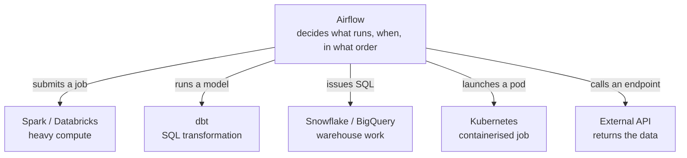

> 💡 **Plain English.** Every box on the right is just "some other system that does the actual
> work." You do not need to know any of them to understand Airflow. For the record: **Spark**
> and **Databricks** crunch very large datasets across many machines; **dbt** organises SQL
> transformations; **Snowflake** and **BigQuery** are data warehouses; **Kubernetes** runs
> software in isolated containers. Airflow talks to all of them the same way — "start this,
> tell me when you're done."

The classic new-joiner mistake is loading a 40 GB spreadsheet-like table into memory inside a
single Airflow step. Airflow will let you. The machine will fall over. The right pattern is to
**push the heavy work down to a system built for it and let Airflow supervise**.

### 2.3 What Airflow is *not*

People often reach for Airflow to solve a problem it was never built for. Here is what it is
**not**, in plain terms — the right-hand column names the tools people use instead, and
**you can safely ignore those names on a first read.** They are there so you recognise them
later, not so you learn them now.

| Airflow is not... | ...which in plain terms means | Tools people use instead |
|---|---|---|
| A stream processor | It works in scheduled batches. The fastest it reacts is roughly a minute — not instantly | Kafka Streams, Flink, Spark Structured Streaming |
| A data processing engine | It does not crunch the numbers itself; it asks something else to | Spark, DuckDB, the warehouse itself |
| A transformation framework | It does not reshape or clean data; it schedules the thing that does | dbt, SQLMesh |
| A sub-second job queue | If you need a reply in milliseconds, this is the wrong shape of tool | Celery, SQS, Temporal |
| A ready-made connector library | It will not pull from Salesforce out of the box; you write that, or buy it | Fivetran, Airbyte — *then have Airflow run them* |
| A data catalogue or quality checker | It does not document your data or verify it is correct | DataHub, OpenMetadata, Great Expectations, Soda |

Airflow 3's Assets feature (§8.5) does add event-driven triggering, and deferrable operators
wait efficiently on external events — but the scheduling loop is still fundamentally batch.
If the requirement is "react within 200 ms", Airflow is the wrong tool, and no amount of
tuning fixes that.

### 2.4 A little history, because it explains the design

Airflow was started in October 2014 by Maxime Beauchemin at Airbnb. It entered the Apache
Software Foundation Incubator in March 2016 and became a Top-Level Project in January 2019.
Version 2.0 landed in December 2020; version 3.0 in April 2025.

That lineage matters. Airflow was built by a data team, for data teams, to run nightly batch
jobs against a warehouse. Concepts like the *data interval* and *backfill* exist because that
was the original problem. Knowing the origin makes the odder corners of the API make sense
rather than seem arbitrary.

**Where the versions stand today:**

| Version | Latest patch | State | First released | Notes |
|---------|--------------|-------|----------------|-------|
| 3.x | 3.3.1 | Actively maintained | 22 Apr 2025 | Build on this |
| 2.x | 2.11.2 | **End of life** since 22 Apr 2026 | 17 Dec 2020 | No fixes, no security patches |
| 1.10 | 1.10.15 | End of life | 27 Aug 2018 | Historical only |

**Supported platforms for Airflow 3.3.x:** Python 3.10–3.14; PostgreSQL 14–18; MySQL 8.0,
8.4, Innovation; Kubernetes 1.30–1.35. SQLite is supported for local development and tests
only — never production. MariaDB is explicitly **not** supported.

---

## 3. The vocabulary

You cannot read the Airflow documentation without these ten words. Learn them now and the
rest of the guide reads easily. The right-hand column maps each one onto this repository.

| Term | What it means | In the YT_ELT example |
|------|---------------|-----------------------|
| **DAG** | The workflow definition — a graph of tasks plus a schedule. Written as a Python file. | "Extract YouTube video statistics daily" |
| **Task** | One node in the graph; one unit of work. | "Fetch one batch of 50 video IDs" |
| **Operator** | A *template* for a task. `BashOperator`, `PythonOperator`, `SQLExecuteQueryOperator`. You instantiate it and get a task. | `PythonOperator` calling `extract_video_stats` |
| **Sensor** | A special operator that *waits* for something — a file, a partition, another DAG. | "Wait until yesterday's raw file lands" |
| **TaskFlow / `@task`** | The modern, decorator-based way to write a Python task. Preferred over `PythonOperator`. | `@task def fetch_batch(...)` |
| **DAG Run** | One execution of the DAG, for one logical date. Many can exist at once. | The run for 2026-09-13 |
| **Task Instance** | One task, within one DAG Run. The thing that actually has a state. | `fetch_batch[3]` in the 2026-09-13 run |
| **XCom** | "Cross-communication" — a small value passed from one task to another, stored in the metadata DB. | The playlist ID string |
| **Connection** | A named, centrally-stored credential/endpoint. | Your YouTube API key and base URL |
| **Asset** | A named logical piece of data. Producing it can trigger downstream DAGs. (Called *Dataset* in Airflow 2.) | `yt_video_stats_raw` |

Two more that carry outsized importance and get their own section (§8):

- **`logical_date`** — the timestamp that *identifies* a DAG Run. It is **not** "now".
- **`data_interval_start` / `data_interval_end`** — the time window the run is responsible for.

The relationship between DAG, DAG Run, Task, and Task Instance trips people up constantly:

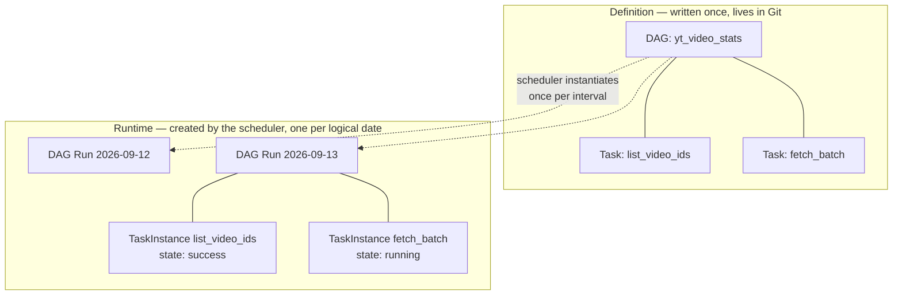

**Definition is static and lives in Git. Runtime state is dynamic and lives in the database.**
Keeping those two mentally separate is the key to understanding everything that follows.

---

## 4. Architecture: the components

### 4.1 Required vs optional

Airflow is not one process. It is a set of cooperating Python processes around a shared
database. In Airflow 3 the split is:

| Component | Required? | One-line job |
|-----------|-----------|--------------|
| **Scheduler** | ✅ Required | Decides what should run next and hands it to the executor |
| **DAG Processor** | ✅ Required | Parses your `.py` files into serialised DAGs in the database |
| **DAG Bundle** | ✅ Required | Where the DAG files come from — a folder, a Git repo, an S3 bucket |
| **API Server** | ✅ Required | Serves the UI, the REST API, *and* the Task Execution API |
| **Metadata Database** | ✅ Required | The single source of truth for all state |
| **Worker** | ⬜ Optional | Actually runs task code. In small setups it lives inside the scheduler |
| **Triggerer** | ⬜ Optional | Runs deferred (async) tasks in an `asyncio` loop |
| **Plugins folder** | ⬜ Optional | Extends Airflow — read by scheduler, DAG processor, triggerer and API server |

> **Important correction to a common belief:** the **executor is not a separate process**.
> It is a configuration property of the scheduler and runs *inside the scheduler process*.
> Many new joiners go looking for an "executor service" to start. There isn't one.
> See §7.

### 4.2 The basic deployment — one machine

This is what you get from `airflow standalone`, and it is the right mental model to start
with. One machine, one person, no security boundaries.

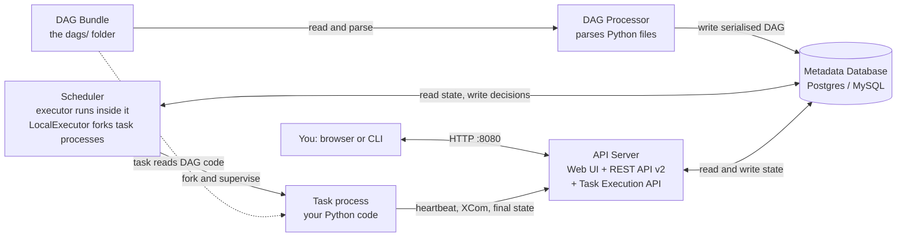

Note what is **already true even here**: the DAG Processor is its own process (mandatory in
Airflow 3), and the task talks to the **API Server**, not to the database.

### 4.3 The distributed deployment — production

At scale, components move onto separate machines with separate security perimeters, and
distinct human roles emerge.

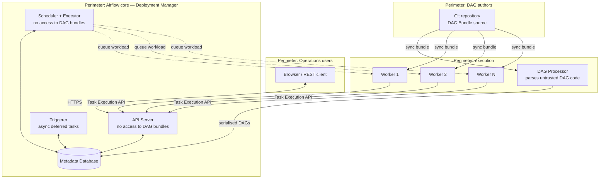

Three security properties are designed into that picture, and they are worth understanding
because they explain *why* Airflow 3 looks the way it does:

1. **The scheduler never touches DAG bundles.** Because the DAG Processor is a separate
   process, DAG-author code is never executed in the scheduler. A malicious or buggy DAG
   cannot take down or subvert the scheduler.
2. **The API Server never executes DAG-author code.** The "Code" tab in the UI reads the
   serialised source *from the database*, not from disk. The API Server only runs code that
   a Deployment Manager installed as a package or plugin.
3. **Workers never touch the database.** They go through the Task Execution API. This is the
   headline Airflow 3 change — see §4.5.

The three roles in the Airflow security model, which you will see referenced in the docs:

| Role | Can do | Cannot do |
|------|--------|-----------|
| **Deployment Manager** | Install, configure, manage the deployment, install packages/plugins | — |
| **DAG author** | Write DAGs and submit them to the bundle | Change deployment config |
| **Operations user** | Trigger DAGs/tasks, monitor runs via the UI | Author DAGs |

### 4.4 Each component in detail

> 🔧 **Engineer depth.** This is reference material — one subsection per component, covering
> what it does, what it does *not* do, how it fails and how you scale it. On a first read, the
> one-line summaries in the §4.1 table are enough. Come back here when you actually operate
> Airflow, or when something breaks.

#### 4.4.1 Scheduler — the brain

**What it does.** Runs a continuous loop. On each pass it asks the database: which DAGs are
due? Which task instances have satisfied dependencies? It creates DAG Runs, moves eligible
task instances to `scheduled`, then hands them to the executor, which queues or launches them.

**What it does *not* do.** It does not parse your DAG files (the DAG Processor does) and it
does not read DAG bundles at all. With `LocalExecutor` it does fork task processes — but that
is the executor's doing, inside the scheduler process.

**How it scales.** Run multiple scheduler instances. Since Airflow 2.0 the scheduler is
horizontally scalable and highly available, using row-level locks in the metadata database to
coordinate. Two schedulers will not double-schedule the same task.

**How it fails.** Scheduler lag — the delay between "task became eligible" and "task was
queued" — is the number to watch. Causes are usually a slow metadata database, too many DAGs,
or `LocalExecutor` task processes competing with the scheduler loop for CPU.

#### 4.4.2 DAG Processor — the parser

**What it does.** Walks the DAG bundle, imports each `.py` file, finds DAG objects,
**serialises** them to JSON, and writes them to the database. It repeats on an interval so
new and edited DAGs get picked up.

**Why it exists as a separate process.** Two reasons, both important:

- **Security.** Parsing means *executing* top-level Python from an untrusted author. Airflow 3
  makes this mandatory and standalone so that code never runs in the scheduler's context.
- **Performance.** Parsing is CPU-heavy. A large deployment may have thousands of DAG files;
  isolating and scaling parsing keeps the scheduling loop fast.

**Why you must care as a DAG author.** Your DAG file is re-imported *constantly* — every few
seconds, per file. Any code at the top level of the file runs every single time. This single
fact is the source of most Airflow performance problems (see §14.1).

> **Airflow 2 note:** there, DAG parsing ran inside the scheduler by default and the
> standalone DAG processor was opt-in. In Airflow 3 it is a required, always-separate process
> and must be started explicitly, even for local development: `airflow dag-processor`.

#### 4.4.3 DAG Bundle — where code comes from

**What it is.** A collection of DAGs *and their supporting files* — helper modules, config,
SQL templates. Configured via `dag_bundle_config_list`. Backends include a local folder
(the default), a Git repository, or S3.

**Why it is better than Airflow 2's "DAGs folder".** In Airflow 2, the DAGs folder had to be
one directory on local disk, and getting code there was entirely the Deployment Manager's
problem. Bundles add **versioning**: a Git bundle lets the scheduler pin a specific commit
when it dispatches a task, so every task in a run executes the same code.

This enables **DAG versioning**. When `rerun_with_latest_version` is `False`, clearing and
re-running an old DAG Run re-executes the *original* code — invaluable when debugging a
failure from three weeks ago.

> ⚠️ With the default local-disk bundle, which does **not** support versioning, the DAG
> Processor and the workers can briefly see different versions of a DAG while both catch up
> to the latest files on disk. Versioned backends such as Git remove that window.

#### 4.4.4 API Server — the front door

Airflow 3 merged what used to be the "webserver" into a single API Server, and it is now
the **sole access point to the metadata database for tasks and workers**. It hosts four
distinct things:

| Surface | Consumer |
|---------|----------|
| React-based Web UI | Humans |
| Stable REST API `/api/v2` (FastAPI) | Scripts, CI, external systems |
| Internal UI API | The UI's own JavaScript |
| **Task Execution API** | Workers running tasks |

That last one is the architectural centrepiece of Airflow 3. Default port is `8080`.

> **Airflow 2 note:** `airflow webserver` no longer exists. The command is `airflow api-server`.
> The old `/api/v1` REST API is replaced by `/api/v2`. Helm chart users: every `webserver`
> key moved under `apiServer`.

#### 4.4.5 Metadata Database — the source of truth

Every piece of runtime state: DAG Runs, task instances and their states, XComs, Connections,
Variables, Pools, serialised DAGs, users and permissions, and the full audit log.

This is your **single point of failure and your most important backup target**. If it is
slow, everything is slow. Production guidance:

- Use PostgreSQL (best-supported) or MySQL. Never SQLite.
- Back it up, and test the restore.
- Run `airflow db clean` on a schedule. XCom and log rows accumulate forever otherwise, and
  a bloated database makes future schema migrations dangerously slow.
- Size the connection pool for the number of schedulers, triggerers and API servers.

#### 4.4.6 Workers — the muscle

Where task code actually executes. Whether you have separate workers at all depends on your
executor (§7):

- `LocalExecutor` — no separate workers; tasks are subprocesses of the scheduler.
- `CeleryExecutor` — long-running worker processes pull from a queue (Redis/RabbitMQ).
- `KubernetesExecutor` — one pod per task, created on demand and destroyed after.

#### 4.4.7 Triggerer — efficient waiting

**The problem it solves.** A sensor that polls "has the file arrived?" every 60 seconds
occupies a whole worker slot while doing nothing. A hundred such sensors consume a hundred
slots to do nothing.

**The solution.** A **deferrable operator** does its setup, then *defers*: it releases the
worker slot entirely and hands a lightweight `Trigger` object to the Triggerer. The Triggerer
runs thousands of these concurrently in a single `asyncio` event loop. When a trigger fires,
the task is rescheduled onto a worker to finish.

**When you need one.** Only if you use deferrable operators or event-driven scheduling.
Optional otherwise — but in any real deployment with sensors, run one.

> Note: **human-in-the-loop** tasks in Airflow 3 wait in a scheduler-managed `awaiting_input`
> state and do **not** use the triggerer.

#### 4.4.8 Plugins — the extension point

An optional folder read by the scheduler, DAG processor, triggerer, and API server. Use it
for custom operators, hooks, macros, FastAPI apps, and UI views.

> ⚠️ **A real footgun.** Unlike `dags/` and `config/` — which are only added to `sys.path` —
> every `.py` file in the plugins tree is *actively imported at startup* and registered as a
> **top-level module under its bare filename**, regardless of subdirectory. A file at
> `plugins/my_company/utils/logging.py` registers as the module `logging`, shadows the
> standard library, and prevents Airflow from starting. Name plugin files uniquely.

### 4.5 The Airflow 3 architecture change you must understand

> 🔧 **Engineer depth.** Genuinely important if you have used Airflow 2 before, or if a
> security team asks how workers reach the database. If neither applies yet, the one thing to
> remember is: *in Airflow 3, the code you write can no longer touch Airflow's own database
> directly — it asks the API Server instead, which is safer.* That sentence is the whole
> section.

This is the difference that matters most if you have seen Airflow before.

**Airflow 2:** every component, including task code on workers, talked **directly to the
metadata database**.

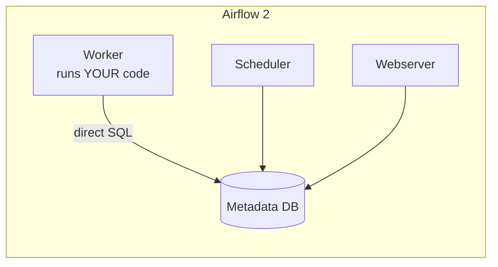

The consequences were serious:
- Task code ran in the same process as Airflow's own execution machinery.
- A DAG author could `import` a database session and do anything to the metadata DB.
- Every concurrent task held a database connection, which capped scalability.
- Workers needed network reachability to the database, which is a hard sell to security teams.

**Airflow 3:** workers go through the **Task Execution API** on the API Server.

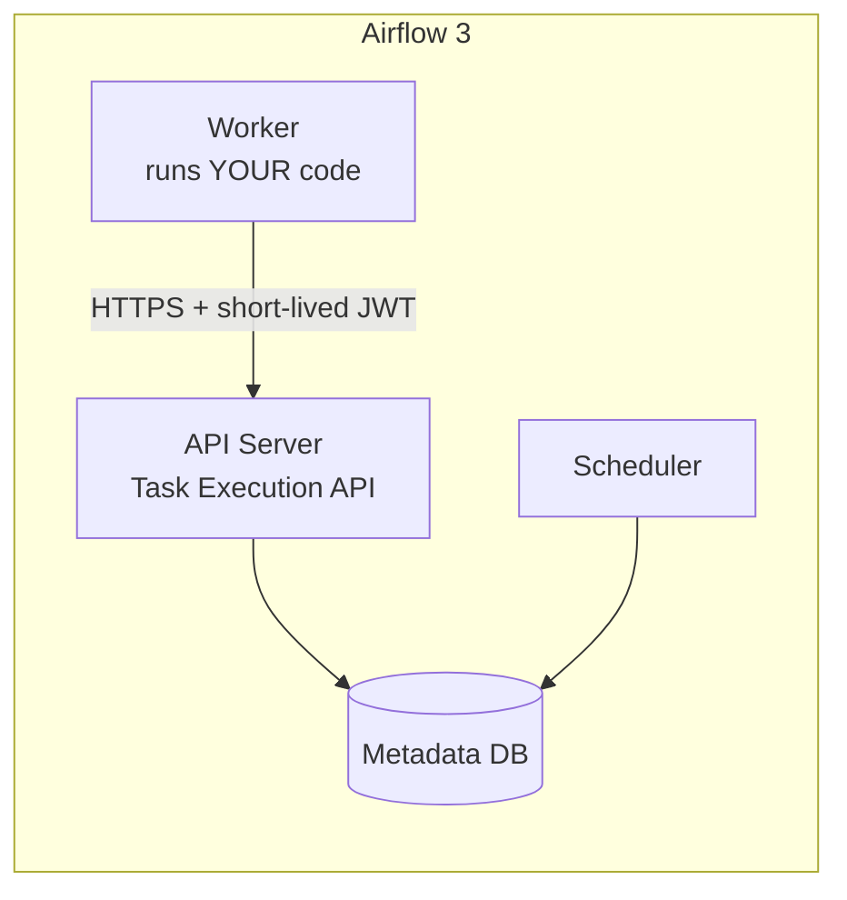

What you gain:

| Benefit | Why |
|---------|-----|
| **Isolation** | Task code cannot reach the metadata DB, by construction |
| **Scalability** | Far fewer DB connections; the API server multiplexes |
| **Remote execution** | A worker only needs HTTPS to the API server — it can live in another VPC, another cloud, or at the edge |
| **A stable contract** | The Task SDK is versioned separately from Airflow core |
| **Multi-language tasks** | The Task Execution Interface is language-agnostic; Go and Java SDKs exist (both experimental) |

**What this means for you as a DAG author:** task code can no longer import Airflow database
sessions or models. If you have custom operators that query the metadata DB directly, they
must migrate to the official Airflow Python Client (REST) instead.

### 4.6 What happens inside a worker when a task runs

> 🔧 **Engineer depth — safe to skip entirely.** This is operating-system detail. Nothing later
> in the document depends on it. The takeaway, if you want one: *your code runs in its own
> separate process, never sees any password, and never connects to a database — Airflow
> handles all of that around it.*

Worth knowing, because it explains where your logs come from and why "the token" never
appears in your code.

A worker does **not** run your code directly. It starts a lightweight **Supervisor** in its
own OS process, which **forks** a second process where the Task SDK runtime (`task_runner`)
executes your code. The two talk over a socket.

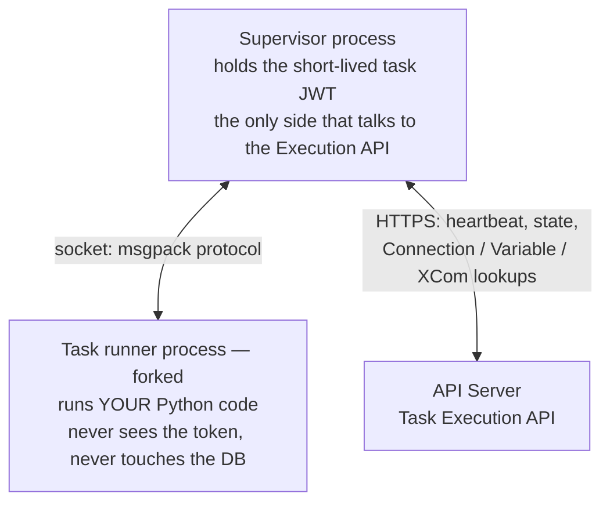

So when your task calls `Variable.get("x")`, the request is *proxied*: your code asks the
Supervisor over the socket, the Supervisor asks the API Server over HTTPS, and the answer
comes back. Your code never holds a credential and never opens a database connection.

The same runtime can also run **in-process** — a single Python process, no fork, no socket,
no HTTP — which is what `dag.test()` uses for local debugging.

---

## 5. How a run actually happens, end to end

Everything above, in one trace. Follow a single task from "someone saved a file" to "the
screen shows a green box".

> 💡 **Plain English.** The diagram below is a *sequence diagram*: time runs downwards, each
> vertical line is one part of Airflow, and each arrow is one part talking to another. Read it
> top to bottom like a conversation. You do not need to follow every arrow — the five numbered
> takeaways underneath are the point.

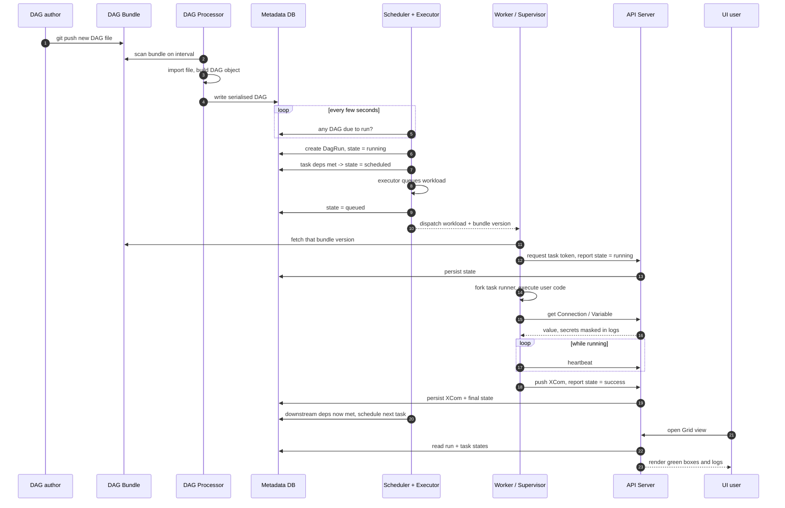

**Five things to take away from that diagram:**

1. **The DAG Processor and the Scheduler never talk to each other.** They communicate only
   through the database. This is why a DAG can take a minute to appear in the UI after you
   save it.
2. **The Scheduler decides; the executor dispatches; the worker executes.** Three distinct
   responsibilities, and the first two live in the same process.
3. **The worker asks for the DAG bundle version the scheduler pinned**, not "latest". That is
   what makes a re-run reproducible.
4. **All worker→Airflow traffic goes through the API Server.** No database connection from
   the worker, anywhere in that sequence.
5. **The heartbeat is how Airflow detects a dead task.** Stop heartbeating and the scheduler
   eventually marks the task as failed and, if configured, retries it.

---

## 6. The task lifecycle

Every coloured box in the Airflow UI is a task instance in one of these states. Knowing the
state machine is how you debug.

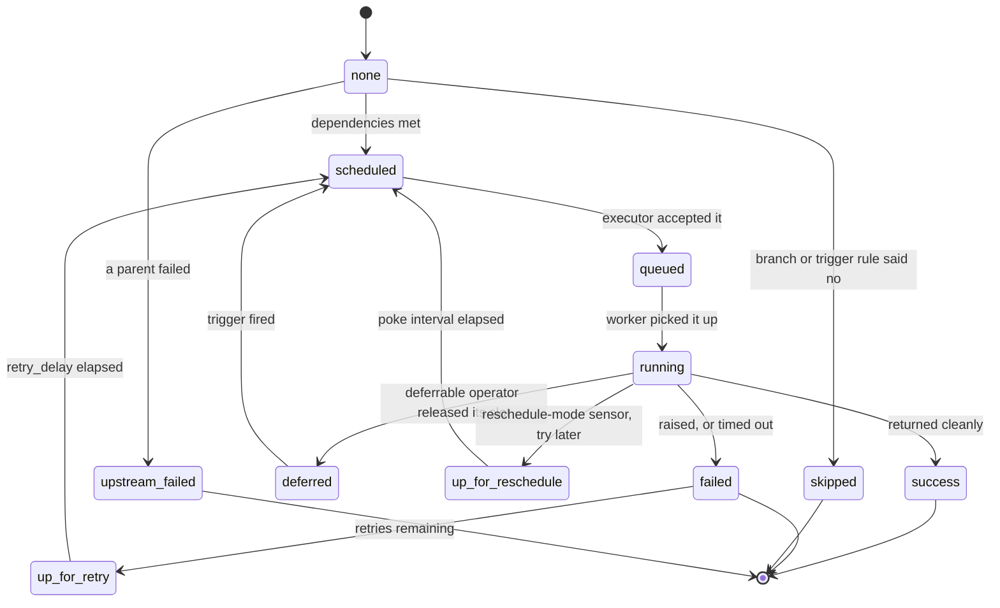

| State | Meaning | What to do when stuck here |
|-------|---------|----------------------------|
| `scheduled` | Deps met; waiting for the executor | Check scheduler health and pool/concurrency limits |
| `queued` | Handed to the executor; not started | Workers down, no free slots, or Celery queue misrouted |
| `running` | Executing right now | Check the task log |
| `success` | Returned without raising | — |
| `failed` | Raised, timed out, or was killed | Read the log; check `retries` |
| `up_for_retry` | Failed with retries remaining | Normal; wait for `retry_delay` |
| `up_for_reschedule` | A `mode="reschedule"` sensor released its slot | Normal for sensors |
| `deferred` | Waiting in the Triggerer | If stuck, the Triggerer is probably not running |
| `skipped` | A branch or trigger rule decided it had nothing to do | Usually intended — verify the branching logic |
| `upstream_failed` | A parent failed, so this never started | Fix the parent |
| `removed` | The task no longer exists in the DAG definition | You deleted a task from a DAG with historic runs |

**DAG Run status is decided by the leaf nodes** — tasks with no children:

- `success` if every leaf is `success` or `skipped`
- `failed` if any leaf is `failed` or `upstream_failed`

> ⚠️ A subtle trap: if a leaf task has `trigger_rule="all_done"`, it runs regardless of what
> happened upstream. If it then succeeds, **the whole DAG Run is marked success even though
> something failed in the middle.** This is the most common cause of "the pipeline was green
> but the data was wrong."

**Trigger rules** control when a task fires relative to its parents. The default is
`all_success`.

| Trigger rule | Fires when |
|--------------|-----------|
| `all_success` *(default)* | All parents succeeded |
| `all_failed` | All parents failed or were upstream-failed |
| `all_done` | All parents finished, whatever the outcome |
| `one_success` | At least one parent succeeded — fires as soon as it does |
| `one_failed` | At least one parent failed — fires as soon as it does |
| `one_done` | At least one parent succeeded or failed |
| `none_failed` | No parent failed; skipped parents are fine |
| `none_failed_min_one_success` | No parent failed **and** at least one succeeded |
| `none_skipped` | No parent was skipped |
| `always` | Immediately, ignoring parents entirely |

`all_done` is the right choice for cleanup tasks. `none_failed_min_one_success` is the right
choice for the join point after a branch.

---

## 7. Executors: where your code runs

> 🔧 **Engineer depth.** This section is about *where* Airflow physically runs your steps —
> on the same machine, on a pool of servers, or in throwaway containers. It matters enormously
> when you deploy Airflow and not at all when you are learning to write workflows. If you are
> new, read §7.1's table for the vocabulary and move on.

The executor is a **configuration property of the scheduler**, set in `[core] executor`, and
it runs **inside the scheduler process**. There is no executor service to start.

```ini
[core]
executor = LocalExecutor
```

```bash
# Check what is actually configured
airflow config get-value core executor
```

### 7.1 The options

| Executor | Category | How tasks run | Best for | Watch out for |
|----------|----------|---------------|----------|---------------|
| **LocalExecutor** *(default)* | Local | Subprocesses of the scheduler | Development; small single-machine production | Tasks compete with the scheduler for CPU |
| **CeleryExecutor** | Queued / batch | Persistent workers pull from Redis or RabbitMQ | Steady, high-throughput workloads | You now operate a message broker; noisy-neighbour contention between tasks on a worker |
| **KubernetesExecutor** | Containerised | One pod per task, created on demand | Bursty or spiky load; per-task dependency isolation | Pod startup latency — poor for many short tasks |
| **EdgeExecutor** | Queued / batch | Remote edge workers pull over HTTP | Tasks that must run on-prem, in another cloud, or at the edge | Newer — check how mature the integration is for your platform |
| **EcsExecutor** / **BatchExecutor** | Containerised / batch | AWS ECS tasks or AWS Batch jobs | AWS-native shops | Cloud-specific |

The official trade-off framing is worth internalising:

- **Local** — very easy, very low latency, minimal setup; limited, and shares resources with
  the scheduler.
- **Queued/batch** — robust, decouples workers from the scheduler, low latency because
  workers are always warm, cost-effective for constant load; noisy neighbours, and idle cost
  when load is spiky.
- **Containerised** — perfect isolation, per-task environments and resource limits, pay only
  while the task runs; startup latency, and you must operate a cluster.

### 7.2 Multiple executors at once

Since Airflow 2.10 you can configure several executors and pick per DAG or per task:

```ini
[core]
executor = LocalExecutor,CeleryExecutor
```

The **first** in the list is the environment default. Then:

```python
# Per task
@task(executor="KubernetesExecutor")
def heavy_training_step():
    ...

# Per DAG, via default_args
with DAG(..., default_args={"executor": "CeleryExecutor"}):
    ...
```

Aliases make this readable: `executor = my_local:LocalExecutor,my_celery:CeleryExecutor`.

> 💡 A **provider** is an add-on package giving Airflow ready-made building blocks for one
> outside system — there is an AWS provider, a Snowflake provider, a Slack provider, and
> hundreds more. You install the ones you need.

> ⚠️ If a DAG references an executor that is not configured, **the DAG fails to parse**, and
> a warning appears in the UI. Every host running an Airflow component must have all
> referenced executors configured.

### 7.3 Removed in Airflow 3

- **SequentialExecutor** — gone. `LocalExecutor` now works with SQLite for local development.
- **CeleryKubernetesExecutor** and **LocalKubernetesExecutor** — gone. These hybrids abused
  the task-instance `queue` field to record which sub-executor to use, which made `queue`
  unusable for its real purpose and required a hand-written class per combination. Use the
  multiple-executor configuration above instead.

### 7.4 How to choose

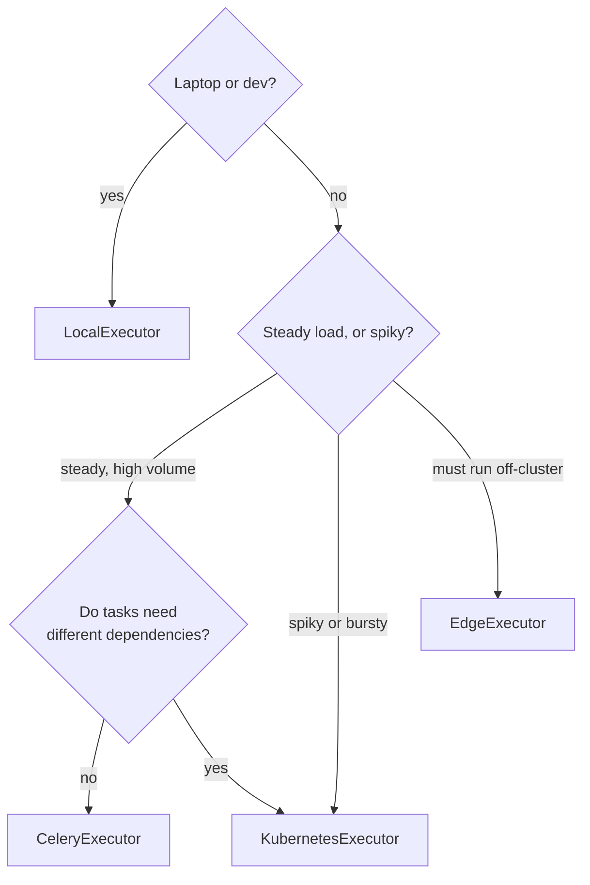

---

## 8. The scheduling model: the part everyone gets wrong

If you only read one section carefully, make it this one. Almost every Airflow support
ticket I have seen in twenty years of data work traces back to a misunderstanding here.

### 8.1 The four parameters

```python
@dag(
    schedule="0 3 * * *",                                # when runs are created
    start_date=pendulum.datetime(2026, 9, 1, tz="UTC"),  # the first interval
    catchup=False,                                       # backfill missed runs?
    max_active_runs=1,                                   # how many runs at once
)
def my_pipeline():
    ...
```

| Parameter | Means | Does **not** mean |
|-----------|-------|-------------------|
| `schedule` | A cron string, a `timedelta`, a `Timetable`, an `Asset`, or `None` | — |
| `start_date` | The beginning of the **first data interval** | "Start running now" |
| `catchup` | Whether to create runs for intervals between `start_date` and now | — |
| `max_active_runs` | Concurrent DAG Runs allowed | Concurrent *tasks* — that is `max_active_tasks` |

> **`start_date` is not "when it starts running."** With a data-interval timetable, a DAG Run
> is only scheduled *one interval after* `start_date`. Set `start_date` in the past and turn
> `catchup` off, and you will simply wait for the next scheduled fire.

### 8.2 `logical_date` versus the data interval

Every DAG Run carries a `logical_date` and a data interval (`data_interval_start` /
`data_interval_end`).

- **`logical_date`** identifies the run. The docs are explicit: *"This value does not contain
  any semantics, but is simply a value for identification."* It was called `execution_date`
  before 2.2, and that name was removed entirely in Airflow 3.
- **`data_interval_start` / `data_interval_end`** carry the real-world meaning: the window of
  data this run is responsible for. Use these when slicing rows by timestamp.

The classic "Airflow is weird about dates" complaint comes from a data-interval timetable:
a daily run *for* 2026-09-12 fires *after* 2026-09-12 has ended, i.e. shortly after midnight
on the 13th. That is deliberate — you cannot summarise a day until the day is over.

### 8.3 The Airflow 3 default changed — read this

Airflow 3 flipped `create_cron_data_intervals` to **`False`**. A bare cron string in
`schedule=` now produces a **`CronTriggerTimetable`**, not the old `CronDataIntervalTimetable`.

| | `CronDataIntervalTimetable` (Airflow 2 default) | `CronTriggerTimetable` (Airflow 3 default) |
|---|---|---|
| Data interval | `start` and `end` differ; `end` is the trigger time | `start == end == ` the trigger time |
| `logical_date` anchored to | `data_interval_start` | the trigger time |
| Enable a `@daily` DAG at 3 PM on 31 Jan | Runs **immediately** — the interval starting 00:00 on the 31st has not run yet. `run_id` timestamp: 31 Jan | Runs at **00:00 on 1 Feb**. `run_id` timestamp: 1 Feb |
| Pause 3 PM 31 Jan, resume 3 PM 2 Feb | Skips 1 Feb only; immediately triggers the 2 Feb run | Skips both 1 and 2 Feb; next run is 00:00 on 3 Feb |

**Practical consequence.** In Airflow 3, for a daily DAG, `{{ ds }}` is the day the run
*fires*. In Airflow 2 it was the day *before*. If you have Airflow 2 habits, or logic keyed
on `ds`/`data_interval_start`, this will silently produce off-by-one-day data.

**What to do:** either accept the new behaviour, or pin it explicitly —

```python
# Keep Airflow 2 data-interval semantics, explicitly and version-independently
from airflow.sdk import CronDataIntervalTimetable, dag

@dag(
    schedule=CronDataIntervalTimetable("0 3 * * *", timezone="UTC"),
    # ... the rest of your DAG arguments
)
def my_pipeline():
    ...
```

Passing an explicit timetable instance makes the config flag irrelevant for that DAG, which
is the robust choice. Set this **before** upgrading: flipping the flag on a DAG that already
has runs skips one scheduled run, to avoid a `logical_date` collision.

### 8.4 Catchup and backfill

**`catchup=True`** means: on unpause, create every run between `start_date` and now. Set a
`start_date` of 2020 with catchup on and you will trigger roughly two thousand runs at once.
This is why Airflow 3 changed the default to **`False`**.

**Backfill** is the deliberate version — "re-process this date range, on purpose":

```bash
airflow backfill create --dag-id yt_video_stats \
  --from-date 2026-09-01 --to-date 2026-09-10
```

In Airflow 3 backfill is scheduler-native — the scheduler manages it, so it is visible and
controllable in the UI rather than being a detached CLI process.

**Backfill only works if your tasks are idempotent.** That is the deal Airflow asks of you
in exchange for re-runnability, and it is the single most important DAG-authoring discipline:

> A task must produce the same result whether it runs once or five times for the same
> logical date.

Concretely: `DELETE` the partition then `INSERT`, or `MERGE`, rather than blind `INSERT`.
Write to `data/2026-09-13/stats.json`, not `data/stats_{{ now }}.json`.

> This repo's script currently writes `yt_stats_{now}.json` — a new file on every execution.
> Fine for a manual script; not idempotent. §9 fixes it.

### 8.5 Assets: scheduling on data, not on time

Sometimes "3 AM" is the wrong trigger. What you actually mean is *"when the extract finishes."*
An **Asset** is a named logical piece of data. A task declares it *produces* one; another DAG
declares it *consumes* one and runs when the asset updates.

```python
from airflow.sdk import Asset, dag, task

video_stats = Asset("s3://yt-elt/raw/video_stats")

# Producer
@task(outlets=[video_stats])
def extract_stats():
    ...

# Consumer — no cron at all
@dag(schedule=[video_stats])
def transform_stats():
    ...
```

Combine assets with `AssetAll` / `AssetAny` for multi-upstream conditions, or with
`AssetOrTimeSchedule` for "when the data lands, **or** at 6 AM whichever comes first."

**Event-driven scheduling** goes one step further: an `AssetWatcher` monitors an external
source such as a queue or object store, and updates the asset when an event arrives — which
triggers the DAG. That is as close to real-time as Airflow gets.

> Assets were called **Datasets** in Airflow 2. The import moved from `airflow.datasets.Dataset`
> to `airflow.sdk.Asset`.

### 8.6 Deadline Alerts

Airflow 2's SLA mechanism was deprecated and **removed** in Airflow 3. Its replacement is
**Deadline Alerts** (`DeadlineAlert`, `DeadlineReference` in `airflow.sdk`), available from
Airflow 3.2 onwards. If you are migrating and relied on `sla=`, this is what you move to.

---

## 9. Turning THIS repo into a DAG

Time to make it concrete.

> 💡 **If you do not read code yet:** §9.1 is a plain before-and-after table and is the part
> that matters — it shows what you *gain* by moving a script into Airflow. Skim the code in
> §9.3, then read §9.5, which explains the five decisions in that code in words. You will
> understand the *why* without parsing the *how*, and that is genuinely enough for now.

### 9.1 What we are changing, and why

| `video_stats.py` today | As an Airflow DAG | Why |
|------------------------|-------------------|-----|
| One `if __name__ == "__main__"` block | Four tasks with declared dependencies | Retry and restart each step independently |
| Fails whole script on one bad batch | Each batch is its own mapped task | One batch fails, nine succeed; retry only the one |
| `API_KEY` from `.env` | Airflow Connection | Central storage, rotation, automatic log masking |
| `CHANNEL_HANDLE` from env | Airflow Variable or DAG `params` | Change it in the UI, no redeploy |
| Output file named by wall-clock time | Output partitioned by logical date | Idempotent and backfillable |
| `logging.info` to a terminal | Per-task-instance logs in the UI | Observability |
| Runs serially, 9 batches one by one | Batches fan out in parallel, throttled by a Pool | Faster, and respects the API quota |

### 9.2 Repository layout

Airflow adds the DAG bundle folder to `sys.path`, so helper code can live alongside the DAGs.
The documented best practice is to put it in a **uniquely named sub-package** — never a
generic name like `utils` or `logging`, which would shadow real modules.

```
YT_ELT/
├── dags/
│   ├── yt_stats_dag.py          # the DAG definition — thin
│   └── yt_elt/                  # unique package name, importable
│       ├── __init__.py
│       └── youtube.py           # the logic from video_stats.py, unchanged
├── data/
├── Dockerfile
└── requirements.txt
```

`dags/yt_elt/youtube.py` holds `get_playlist_id`, `get_all_video_ids`, `batch_list` and
`extract_video_stats`, lifted from `video_stats.py` with one change: **take the API key and
base URL as arguments** instead of reading module-level globals, so the DAG can inject them
from a Connection.

> **Why keep the logic out of the DAG file?** Because the DAG Processor re-imports
> `yt_stats_dag.py` every few seconds. The DAG file should define structure and nothing else.
> It also means the extraction logic stays unit-testable without Airflow installed.

### 9.3 The DAG

```python
"""Daily extract of YouTube channel video statistics."""

from __future__ import annotations

import json
import logging
from datetime import timedelta
from pathlib import Path

import pendulum
from airflow.sdk import Asset, Variable, dag, task

log = logging.getLogger(__name__)

RAW_ROOT = Path("/opt/airflow/data/yt_stats")
BATCH_SIZE = 50

video_stats_raw = Asset("file://yt_elt/video_stats_raw")


@dag(
    dag_id="yt_video_stats",
    schedule="0 3 * * *",
    start_date=pendulum.datetime(2026, 9, 1, tz="UTC"),
    catchup=False,
    max_active_runs=1,
    default_args={
        "retries": 3,
        "retry_delay": timedelta(minutes=5),
        "execution_timeout": timedelta(minutes=30),
    },
    tags=["youtube", "elt", "extract"],
    doc_md=__doc__,
)
def yt_video_stats():
    @task
    def resolve_uploads_playlist() -> str:
        """Channel handle -> uploads playlist ID. Returns ~34 bytes: XCom is fine."""
        from yt_elt.youtube import get_playlist_id

        handle = Variable.get("yt_channel_handle")
        playlist_id = get_playlist_id(handle)
        log.info("Channel %s -> uploads playlist %s", handle, playlist_id)
        return playlist_id

    @task
    def list_video_ids(playlist_id: str) -> list[str]:
        """Page through the playlist. ~400 IDs x 11 chars ~= 5 KB: XCom is fine."""
        from yt_elt.youtube import get_all_video_ids

        video_ids = get_all_video_ids(playlist_id)
        log.info("Collected %s video IDs", len(video_ids))
        return video_ids

    @task
    def make_batches(video_ids: list[str]) -> list[dict]:
        """Split into API-sized batches. Each dict becomes one mapped task instance."""
        return [
            {"index": i // BATCH_SIZE, "ids": video_ids[i : i + BATCH_SIZE]}
            for i in range(0, len(video_ids), BATCH_SIZE)
        ]

    @task(pool="youtube_api", retries=5, retry_exponential_backoff=True)
    def fetch_batch(batch: dict, **context) -> str:
        """Fetch one batch. Writes to disk and returns the PATH, never the payload."""
        from yt_elt.youtube import extract_video_stats

        run_dir = RAW_ROOT / context["ds"]
        run_dir.mkdir(parents=True, exist_ok=True)

        # Deterministic filename -> re-running overwrites rather than duplicating.
        out = run_dir / f"batch_{batch['index']:04d}.json"
        out.write_text(json.dumps(extract_video_stats(batch["ids"]), indent=2))

        log.info("Batch %s: wrote %s records to %s",
                 batch["index"], len(batch["ids"]), out)
        return str(out)

    @task(outlets=[video_stats_raw], trigger_rule="all_success")
    def merge_batches(paths: list[str], **context) -> str:
        """Combine batch files into one partitioned output and publish the Asset."""
        records: list[dict] = []
        for p in sorted(paths):
            records.extend(json.loads(Path(p).read_text()))

        final = RAW_ROOT / context["ds"] / "video_stats.json"
        final.write_text(json.dumps(records, indent=2))

        log.info("Merged %s batches into %s records at %s",
                 len(paths), len(records), final)
        return str(final)

    playlist_id = resolve_uploads_playlist()
    video_ids = list_video_ids(playlist_id)
    batches = make_batches(video_ids)
    merge_batches(fetch_batch.expand(batch=batches))


yt_video_stats()
```

### 9.4 The resulting graph

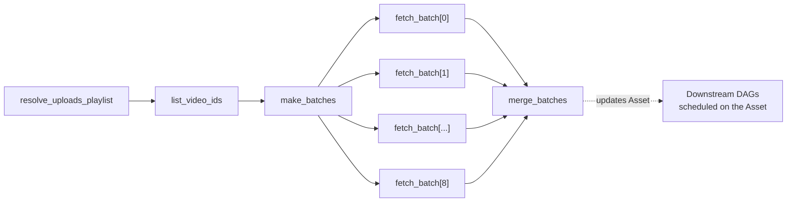

### 9.5 The five decisions worth explaining

**1. `fetch_batch.expand(batch=batches)` — dynamic task mapping.** The number of batches is
not known until `list_video_ids` runs. `.expand()` creates one task instance per element at
runtime. Each gets its own retry counter, its own log, and its own box in the UI. A 403 on
batch 7 fails exactly one task instance; clearing and retrying it re-fetches 50 videos, not
all 400.

**2. `pool="youtube_api"` — quota protection.** Create a Pool with, say, 4 slots in the UI.
No matter how many batches or how many concurrent DAG Runs, at most 4 tasks hit the YouTube
API at once. This is Airflow's answer to rate limiting and it is far better than `sleep()`.

**3. Paths in XCom, never payloads.** `fetch_batch` returns a filesystem path, not the JSON.
The stats for 400 videos run to hundreds of kilobytes; that belongs on disk or in object
storage, with only a pointer in XCom. See §10.

**4. `context["ds"]` in the output path.** Output is partitioned by logical date and the
filename is deterministic, so re-running overwrites rather than accumulating. That is what
makes backfill safe. Remember from §8.3 that under Airflow 3's default `CronTriggerTimetable`,
`ds` is the day the run *fires*.

**5. `Variable.get` and a Connection instead of `.env`.** The channel handle becomes an
Airflow Variable, editable in the UI without a redeploy. The API key becomes a Connection —
stored encrypted, and automatically masked in logs.

### 9.6 Testing it without a scheduler

```bash
# Parse-check: does the file import and build a valid DAG?
python dags/yt_stats_dag.py

# List what Airflow sees
airflow dags list
airflow tasks list yt_video_stats

# Run one task instance in isolation — no scheduler, no DB state written
airflow tasks test yt_video_stats resolve_uploads_playlist 2026-09-13

# Run the whole DAG in-process, ideal for breakpoint debugging
python -c "from dags.yt_stats_dag import yt_video_stats; yt_video_stats().test()"
```

`airflow tasks test` and `dag.test()` are the fastest feedback loop in Airflow. Use them
before you ever open the UI.

---

## 10. Passing data between tasks (XCom)

Tasks may run on different workers, in different containers, on different machines. They
share no memory. Airflow gives you three ways to pass data, and choosing wrongly is one of
the most common causes of production incidents.

| Mechanism | Good for | Limit |
|-----------|----------|-------|
| **XCom** | Small metadata — IDs, counts, paths, flags | Stored as a row in the metadata DB |
| **Object storage** | Actual data — files, dataframes, extracts | Whatever your storage allows |
| **TaskFlow return values** | The ergonomic wrapper over XCom — same limits apply | Same as XCom |

### 10.1 How big is "small"?

Airflow does not enforce a universal application-level cap; the real constraint is the
database. PostgreSQL starts moving anything over about 8 KB into separate overflow storage. Airflow also
**never cleans XComs up automatically**, so large values permanently bloat the metadata
database and slow down every future schema migration.

**Rule of thumb: keep XComs under a few kilobytes. Pass references, not payloads.**

```python
# ❌ Don't — a dataframe through the metadata database
@task
def extract():
    return pd.read_csv(...)          # 200 MB into a DB row

# ✅ Do — pass the pointer
@task
def extract() -> str:
    df = pd.read_csv(...)
    path = "s3://bucket/raw/2026-09-13.parquet"
    df.to_parquet(path)
    return path                       # 40 bytes
```

### 10.2 When you genuinely need large XComs

> 🔧 **Engineer depth.** Configuration detail. The rule from §10.1 — *pass a location, not the
> data itself* — is all you need until you hit this problem for real.

Configure a **custom XCom backend**. The Object Storage XCom Backend in the Common IO
provider is the easiest route, and it can route by size:

```bash
# -1 (default): everything in the metadata DB
#  0          : everything in object storage
#  N          : anything larger than N bytes goes to object storage
AIRFLOW__COMMON_IO__XCOM_OBJECTSTORAGE_THRESHOLD=1048576
```

### 10.3 An Airflow 3 behaviour change

`xcom_pull()` without `task_ids` now pulls **only from the current task**. In Airflow 2 it
searched every task in the DAG Run and returned the most recent push for that key.

```python
# Airflow 2: searched the whole DAG run.  Airflow 3: current task only.
value = ti.xcom_pull(key="shared_state")

# Airflow 3: be explicit
value = ti.xcom_pull(task_ids="upstream_task", key="shared_state")
```

If you inherit Airflow 2 DAGs, grep for bare `xcom_pull(key=...)` calls before upgrading.

---

## 11. Connections, Variables, and Pools

Three small features that separate a hobby DAG from a production one.

### 11.1 Connections — credentials and endpoints

A **Connection** is a named, encrypted credential record: host, schema, login, password,
port, and a free-form `extra` JSON field. Define it once in the UI, the CLI, an environment
variable, or an external secrets backend (AWS Secrets Manager, HashiCorp Vault, GCP Secret
Manager) — and reference it by ID from any DAG.

```python
from airflow.sdk import Connection

conn = Connection.get("youtube_api")
api_key = conn.password
base_url = conn.host
```

Why this beats `.env`:

- **Encrypted at rest** in the metadata DB, scrambled with a secret key so that anyone
  reading the raw database sees nothing useful. (The encryption scheme is called *Fernet*.)
- **Automatically masked in logs** — if the value appears in a log line, Airflow redacts it.
- **Rotated in one place** — no redeploy, no rebuild.
- **Access-controlled** — DAG authors need not see the value to use it.
- **Backed by your real secret store** in production, rather than a file on a disk.

Most provider operators take a `*_conn_id` argument, so you rarely fetch the connection
yourself — you hand the ID to the operator and it does the rest.

### 11.2 Variables — configuration

A **Variable** is a simple key/value store for configuration that changes without a code
change: a channel handle, a lookback window, a feature flag, a list of regions.

```python
from airflow.sdk import Variable

handle = Variable.get("yt_channel_handle")
config = Variable.get("yt_config", deserialize_json=True)
```

> ⚠️ **Never call `Variable.get()` at the top level of a DAG file.** Top-level code runs on
> every parse — every few seconds, per file — so a top-level `Variable.get()` becomes a
> continuous stream of database queries. Call it *inside* a task, or use a template placeholder
> (`"{{ var.value.yt_channel_handle }}"` — the `{{ }}` syntax is called *Jinja*), which Airflow
> fills in only at the moment the task runs.

### 11.3 Pools — concurrency limits

A **Pool** is a named bucket of slots. Tasks assigned to a pool queue up when its slots are
exhausted.

```python
@task(pool="youtube_api", pool_slots=1)
def fetch_batch(batch: dict) -> str:
    ...
```

This is how you protect a shared resource — an API quota, a database connection limit, a
licensed cluster — across *all* DAGs, not just one. It composes with:

| Setting | Scope |
|---------|-------|
| `pool` | Across every DAG that uses the pool |
| `max_active_runs` | Concurrent DAG Runs of one DAG |
| `max_active_tasks` | Concurrent task instances within one DAG |
| `max_active_tis_per_dag` | Concurrent instances of *one task* across runs |
| `[core] parallelism` | Total concurrent tasks in the whole deployment |

---

## 12. Business use cases

### 12.1 The patterns

| Pattern | What it looks like | Why Airflow fits |
|---------|--------------------|------------------|
| **Nightly warehouse load** | Extract from 30 sources → land in S3 → load to Snowflake → run dbt → refresh BI extracts | Complex dependencies, must be backfillable, must alert on failure |
| **ML training pipeline** | Pull features → validate → train → evaluate → register model → deploy if metrics improve | Branching on evaluation results, per-step retries, GPU tasks isolated to their own pods |
| **Reverse ETL** | Warehouse → CRM/ad platforms/support tools | Rate-limited APIs need pools; partial failures need per-target retry |
| **Regulatory reporting** | Assemble, reconcile, produce a report, submit by a deadline | Auditability and deadline alerting are requirements, not features |
| **Data quality gates** | Load → run checks → branch: publish, or quarantine and alert | Branching plus trigger rules express this directly |
| **Infrastructure automation** | Snapshot databases, rotate credentials, rebuild search indexes, expire old data | It is a general job orchestrator, not only a data tool |
| **SaaS API aggregation** | Exactly what this repo does — paginate an API, batch calls, land raw JSON | Pagination, quota limits, and retries are Airflow's bread and butter |

### 12.2 Real-world framing by industry

| Industry | Typical pipeline | Airflow feature that earns its keep |
|----------|------------------|--------------------------------------|
| Retail / e-commerce | Overnight sales, inventory and pricing consolidation across stores and channels | Backfill after a source system outage |
| Financial services | End-of-day position and risk calculations, regulatory submissions | Deadline alerts; full audit trail |
| Healthcare | Claims ingestion, de-identification, analytics marts | Access-controlled connections; per-task isolation for PHI |
| Media / marketing | Campaign and engagement metrics pulled from a dozen platform APIs | Pools for per-platform rate limits |
| Manufacturing / IoT | Sensor batch aggregation, anomaly detection, maintenance scheduling | Asset-driven triggering when batches land |
| SaaS | Usage metering, billing runs, churn features | Idempotency — a billing run must never double-charge |

### 12.3 How to justify it to a stakeholder

Three arguments that land with non-engineers:

1. **Reliability** — "When a source API fails at 2 AM, the pipeline retries by itself, and
   if it still fails the on-call engineer is paged with the exact failing step and its logs.
   Today, we find out when someone opens the dashboard at 9 AM."
2. **Recoverability** — "When we discover last Tuesday's data was wrong, we re-run last
   Tuesday. Just last Tuesday. In one click."
3. **Institutional knowledge** — "The dependency graph *is* the documentation, it is in Git,
   and it is reviewed. When someone leaves, the pipeline does not leave with them."

---

## 13. Pros, cons, and when not to use Airflow

An honest assessment. Airflow is the default choice for good reasons and has real costs.

### 13.1 Strengths

| Strength | What it means in practice |
|----------|---------------------------|
| **Workflows as code** | Git, code review, tests, parameterisation, dynamically generated DAGs |
| **Enormous provider ecosystem** | Hundreds of maintained integrations — AWS, GCP, Azure, Snowflake, dbt, Spark, Kubernetes, Slack, and more |
| **Genuinely mature** | A decade in production at thousands of companies; the failure modes are known and documented |
| **Vendor neutral** | Apache-governed. Runs on your laptop, your Kubernetes cluster, or as managed MWAA / Cloud Composer / Astronomer |
| **Excellent operational UI** | Grid, Graph, Gantt, per-task logs, clear-and-rerun, manual trigger |
| **First-class backfill** | Re-processing history is a designed-in feature, not a hack |
| **Scales to real size** | Tens of thousands of tasks a day on a well-tuned cluster |
| **Deep talent pool** | Airflow experience is common; hiring and handover are easy |

### 13.2 Weaknesses

| Weakness | Mitigation |
|----------|------------|
| **Operationally heavy** — five processes plus a database, for a single cron job | Use a managed service, or start with `LocalExecutor` |
| **Latency floor** — scheduling granularity is roughly a minute | Use deferrable operators and assets; accept it is a batch tool |
| **Steep concept curve** — `logical_date`, data intervals, catchup, trigger rules | This document; and §14's list of traps |
| **Top-level code is a landmine** | Enforce it in code review — §14.1 |
| **Local testing is awkward** compared to a plain script | `dag.test()`, `airflow tasks test`, keeping logic in importable modules |
| **Dependency conflicts** — DAG dependencies share the Airflow environment | `KubernetesExecutor`, `PythonVirtualenvOperator`, or `@task.docker` |
| **Not a data-lineage tool** — it knows task order, not column lineage | OpenLineage integration, plus a catalogue |
| **Upgrades are real projects** — 2→3 is breaking | Budget for it; use the Ruff `AIR3` rules (§16) |

### 13.3 When *not* to use Airflow

Do not reach for Airflow when:

- **You have one or two simple jobs.** Cron plus good logging is genuinely the right answer.
  Airflow's operational overhead is not justified below roughly a dozen interdependent jobs.
- **You need sub-second or true streaming.** Use Kafka Streams, Flink, or Spark Structured
  Streaming.
- **The work is request/response.** Use a web service and a job queue.
- **You need long-running workflows that remember where they are** and can undo earlier
  steps when a later one fails — a multi-day order-fulfilment process, for instance. Temporal
  is purpose-built for this.
- **Your pipeline is entirely SQL in one warehouse.** dbt Cloud or SQLMesh may cover it,
  with far less to operate.
- **You have no one to operate it.** An unmaintained Airflow is worse than cron, because it
  fails in more interesting ways. If nobody owns it, buy a managed service.

### 13.4 The alternatives, fairly

| Tool | Where it is genuinely better | Where Airflow wins |
|------|------------------------------|--------------------|
| **Dagster** | Asset-first model, strong typing, excellent local dev and testing story | Ecosystem size, maturity, talent availability |
| **Prefect** | Lightweight, dynamic runtime graphs, gentle learning curve | Scheduling maturity, backfill, breadth of integrations |
| **Temporal** | Durable execution, long-running stateful workflows, sagas | Data-pipeline ergonomics, scheduling, backfill |
| **Argo Workflows** | Kubernetes-native, container-first, very lightweight | Python authoring, data-aware features, UI for data teams |
| **AWS Step Functions / Azure Data Factory** | Fully managed, deep native cloud integration | Portability, code-based authoring, no vendor lock-in |
| **dbt Cloud** | Purpose-built for SQL transformation | Everything that is not SQL transformation |
| **cron** | Trivial, universal, zero operational cost | Literally every point in §1.3 |

**My recommendation after two decades of this:** if you are building a general-purpose data
platform and you need something that will still be supportable in five years with engineers
you can actually hire, Airflow remains the default. If you are greenfield, small, and your
mental model is genuinely asset-centric rather than task-centric, Dagster deserves a serious
evaluation. Everything else is a niche fit — an excellent one within its niche.

---

## 14. Mistakes new joiners make

This list is worth more than the rest of the guide. Read it before your first pull request.

### 14.1 Heavy code at the top level of a DAG file

**The single most common and most damaging mistake.**

```python
# ❌ This runs every few seconds, on every parse, forever
import pandas as pd
df = pd.read_sql("SELECT * FROM huge_table", conn)   # DB hammered continuously
API_KEY = requests.get("https://vault/secret").json() # network call on every parse
handle = Variable.get("yt_channel_handle")            # DB query on every parse

@task
def process():
    return df.sum()
```

```python
# ✅ Everything expensive lives inside a task
@task
def process():
    import pandas as pd
    from airflow.sdk import Variable

    handle = Variable.get("yt_channel_handle")
    df = pd.read_sql("SELECT * FROM huge_table", conn)
    return df.sum()
```

The DAG file should contain **structure and nothing else**. Airflow's own guidance is that a
DAG file should parse in under 30 seconds; realistically, aim for well under one.

### 14.2 Non-idempotent tasks

```python
# ❌ Re-running duplicates rows; a new file every execution
cursor.execute("INSERT INTO stats SELECT * FROM staging")
path = f"stats_{datetime.now()}.json"

# ✅ Re-running replaces; deterministic filename
cursor.execute("DELETE FROM stats WHERE dt = %s", (ds,))
cursor.execute("INSERT INTO stats SELECT * FROM staging WHERE dt = %s", (ds,))
path = f"stats/{ds}/data.json"
```

If a task is not idempotent, retries and backfills corrupt your data instead of fixing it.

### 14.3 `datetime.now()` anywhere that matters

```python
# ❌ Breaks backfill: a re-run of 1 September pulls today's data
yesterday = datetime.now() - timedelta(days=1)

# ✅ Derive from the run's own interval
@task
def extract(**context):
    start = context["data_interval_start"]
```

Also never use `datetime.now()` for `start_date` — it makes the DAG's first interval move
every time the file is parsed, and the DAG may never schedule at all.

### 14.4 Giant XComs

Covered in §10. Pass paths, not payloads.

### 14.5 `time.sleep()` to wait for something

```python
# ❌ Occupies a worker slot doing nothing for an hour
time.sleep(3600)

# ✅ Deferrable sensor: releases the slot, waits in the Triggerer
wait = S3KeySensor(task_id="wait", bucket_key="...", deferrable=True)
```

### 14.6 One DAG to rule them all

A 400-task DAG is unreadable, slow to parse, and impossible to re-run partially. Split by
business domain and connect the pieces with Assets (§8.5). Use `TaskGroup` to organise
within a DAG.

### 14.7 Credentials in the DAG file

```python
# ❌ In Git, in the UI's Code tab, in every developer's clone
API_KEY = "AIzaSyC..."

# ✅ Fetched at runtime, encrypted at rest, masked in logs
conn = Connection.get("youtube_api")
```

### 14.8 Assuming `catchup=False` means "no history"

It means "do not create runs for the past *on unpause*." Backfill is still available and
still your responsibility to use correctly.

### 14.9 Ignoring the `trigger_rule` on leaf tasks

Revisit §6. A leaf task with `all_done` can paint a failed pipeline green.

### 14.10 Not setting `execution_timeout`

Without it, a hung task holds its slot indefinitely. Set a timeout on every task that touches
a network.

```python
default_args = {"execution_timeout": timedelta(minutes=30)}
```

### 14.11 Reusing generic module names

Anything in `dags/`, `config/`, or `plugins/` is on `sys.path`. A file named `logging.py`,
`json.py`, or an `airflow/` folder will shadow real modules and break the deployment in
confusing ways. Use a unique top-level package — `yt_elt`, not `utils`.

---

## 15. Running Airflow locally

> 🔧 **Engineer depth.** Hands-on setup. Worth doing in your first week *with someone beside
> you*, because seeing the components start up makes §4 click. Not something to read cold.

### 15.1 The fastest path

```bash
pip install "apache-airflow==3.3.1" \
  --constraint "https://raw.githubusercontent.com/apache/airflow/constraints-3.3.1/constraints-3.10.txt"

airflow standalone
```

`airflow standalone` initialises the database, creates an admin user, and starts every
component. Open <http://localhost:8080>.

> The generated admin password is **not always printed** in Airflow 3. Find it at:
> `$AIRFLOW_HOME/simple_auth_manager_passwords.json.generated`

### 15.2 Running the components yourself

This is what you do in production, and it is instructive to do once by hand:

```bash
airflow db migrate         # create or upgrade the schema
airflow api-server --port 8080   # UI + REST API + Task Execution API
airflow scheduler          # the brain (executor runs inside this)
airflow dag-processor      # REQUIRED in Airflow 3, even locally
airflow triggerer          # only if you use deferrable operators
```

> If you have Airflow 2 muscle memory: `airflow webserver` is gone — it is `airflow api-server`
> now — and `airflow dag-processor` is new and mandatory. Forgetting the DAG processor is the
> most common Airflow 3 first-run problem: the UI comes up, and no DAGs ever appear.

### 15.3 Useful CLI commands

```bash
airflow dags list                                   # what Airflow can see
airflow dags list-import-errors                     # why your DAG isn't showing up
airflow tasks list yt_video_stats                   # tasks in a DAG
airflow tasks test yt_video_stats fetch_batch 2026-09-13   # run one task, no DB writes
airflow dags test yt_video_stats 2026-09-13         # run the whole DAG in-process
airflow backfill create --dag-id yt_video_stats \
  --from-date 2026-09-01 --to-date 2026-09-10
airflow config get-value core executor              # which executor is configured
airflow db clean --clean-before-timestamp 2026-01-01  # trim old metadata
```

`airflow dags list-import-errors` is the first command to run whenever a DAG "isn't there".

### 15.4 This repository's Dockerfile

The repo already contains a Dockerfile:

```dockerfile
ARG AIRFLOW_VERSION=3.2.2
ARG PYTHON_VERSION=3.14

FROM apache/airflow:${AIRFLOW_VERSION}-python${PYTHON_VERSION}

ARG AIRFLOW_VERSION

ENV AIRFLOW_HOME=/opt/airflow

COPY requirements.txt /

RUN pip install --no-cache-dir "apache-airflow==${AIRFLOW_VERSION}" -r /requirements.txt
```

**What it gets right.** This is very close to the official "extending the image with a
requirements file" example, line for line. Two details are correct and non-obvious:

- **`apache/airflow:3.2.2-python3.14` is a real published tag** — Airflow has supported
  Python 3.10–3.14 since 3.2.0. (Verified against Docker Hub; the tag was pushed 29 May 2026.)
- **Re-pinning `apache-airflow==${AIRFLOW_VERSION}` inside the same `pip install`** is the
  officially documented trick. Without it, resolving your requirements can silently upgrade
  or downgrade Airflow itself and produce an image that no longer matches the base.

**What I would change.**

1. **Add the constraints file.** Since Airflow 2.9 the image ships the constraints it was
   built with at `${HOME}/constraints.txt`. Using it stops a transitive dependency from
   breaking Airflow:

   ```dockerfile
   RUN pip install --no-cache-dir "apache-airflow==${AIRFLOW_VERSION}" \
       -r /requirements.txt --constraint "${HOME}/constraints.txt"
   ```

2. **Split dev dependencies out.** `requirements.txt` currently pins `black==26.5.1`, a code
   formatter. It has no business in a runtime image — it adds size and attack surface. Move
   it to `requirements-dev.txt`.

3. **Pin only your direct dependencies.** The file pins `certifi`, `charset-normalizer`,
   `idna`, `urllib3`, `click`, `packaging` and `pathspec` — all transitive dependencies of
   `requests` and `black`, and several are also dependencies of Airflow itself. Pinning them
   independently is how you get an unresolvable image six months from now. The only direct
   runtime dependencies here are `requests` and `python-dotenv`.

4. **`ENV AIRFLOW_HOME=/opt/airflow` is redundant** — the official image already sets it.
   Harmless, but it reads as though it were doing something.

5. **Consider bumping to 3.3.1.** 3.2.2 is fine and supported; 3.3.1 is the current release
   and brings Deadline Alerts maturity and the stateful-task features.

6. **Note what is deliberately absent.** There is no `COPY dags/`. That is the right call if
   you mount the DAG bundle as a volume or sync it from Git — just be aware that this image
   alone does not carry your DAGs.

A revised version:

```dockerfile
ARG AIRFLOW_VERSION=3.3.1
ARG PYTHON_VERSION=3.14

FROM apache/airflow:${AIRFLOW_VERSION}-python${PYTHON_VERSION}
ARG AIRFLOW_VERSION

# AIRFLOW_HOME is already /opt/airflow in the base image.

COPY requirements.txt /
RUN pip install --no-cache-dir \
      "apache-airflow==${AIRFLOW_VERSION}" \
      -r /requirements.txt \
      --constraint "${HOME}/constraints.txt"
```

with `requirements.txt` reduced to direct dependencies only:

```text
requests==2.34.2
python-dotenv==1.2.3
```

### 15.5 Docker Compose for a fuller local stack

For a multi-container local environment closer to production, the Airflow project publishes
an official `docker-compose.yaml` — Postgres, Redis, API server, scheduler, DAG processor,
triggerer and Celery workers — documented under *Running Airflow in Docker*. Use it once to
see the components as separate containers; it makes §4 concrete in a way no diagram can.

---

## 16. Airflow 2 → 3 cheat sheet

> 🔧 **Skip this entirely unless you have used Airflow 2 before.** It exists so that someone
> with prior experience can find what changed. If Airflow 3 is the only Airflow you have ever
> seen, none of this is relevant to you — it is a list of things that no longer exist.

If you have prior Airflow experience, this is what changed.

### 16.1 Architecture

| Airflow 2 | Airflow 3 |
|-----------|-----------|
| `airflow webserver` (Flask + Flask-AppBuilder) | `airflow api-server` (FastAPI, React UI) |
| DAG parsing inside the scheduler by default | `airflow dag-processor` — separate and **mandatory** |
| Workers connect directly to the metadata DB | Workers use the **Task Execution API** over HTTPS |
| DAGs folder — one local directory | **DAG Bundles** — local, Git, or S3, with versioning |
| REST API `/api/v1` | REST API `/api/v2` |

### 16.2 Removed outright

| Removed | Replacement |
|---------|-------------|
| SubDAGs | TaskGroups, Assets, data-aware scheduling |
| SequentialExecutor | `LocalExecutor` (works with SQLite for dev) |
| `CeleryKubernetesExecutor`, `LocalKubernetesExecutor` | Multiple-executor configuration |
| SLAs (`sla=`) | **Deadline Alerts** (Airflow 3.2+) |
| `--subdir` / `-S` CLI argument | DAG Bundles |
| Direct metadata DB access from task code | Task Execution API / Airflow Python Client |
| Context keys: `execution_date`, `tomorrow_ds`, `yesterday_ds`, `prev_ds`, `next_ds`, `prev_execution_date`, `next_execution_date` and their `_nodash` variants | `logical_date`, `data_interval_start`, `data_interval_end` |

### 16.3 Default changes that will bite you

| Setting | Airflow 2 | Airflow 3 | Effect |
|---------|-----------|-----------|--------|
| `catchup_by_default` | `True` | **`False`** | Unpausing an old DAG no longer floods you with runs |
| `create_cron_data_intervals` | `True` | **`False`** | Bare cron strings now use `CronTriggerTimetable` — see §8.3 |
| `xcom_pull()` without `task_ids` | Searched the whole DAG Run | Current task only | Silent behaviour change |
| `auth_manager` | FAB | **Simple Auth** | Install the FAB provider to keep the old behaviour |

### 16.4 Import changes

Everything a DAG author touches moved to `airflow.sdk`:

| Old | New |
|-----|-----|
| `airflow.decorators.dag` / `.task` / `.task_group` | `airflow.sdk.dag` / `.task` / `.task_group` |
| `airflow.models.dag.DAG` | `airflow.sdk.DAG` |
| `airflow.models.baseoperator.BaseOperator` | `airflow.sdk.BaseOperator` |
| `airflow.sensors.base.BaseSensorOperator` | `airflow.sdk.BaseSensorOperator` |
| `airflow.hooks.base.BaseHook` | `airflow.sdk.BaseHook` |
| `airflow.models.connection.Connection` | `airflow.sdk.Connection` |
| `airflow.models.variable.Variable` | `airflow.sdk.Variable` |
| `airflow.utils.task_group.TaskGroup` | `airflow.sdk.TaskGroup` |
| `airflow.models.param.Param` | `airflow.sdk.Param` |
| `airflow.datasets.Dataset` | `airflow.sdk.Asset` |
| `airflow.io.*` | `airflow.sdk.io.*` |

Also: `BashOperator`, `PythonOperator`, `ExternalTaskSensor`, `FileSensor` and friends moved
out of core into the **`apache-airflow-providers-standard`** package. Install it.

### 16.5 The migration path

```bash
# 1. Get to the latest 2.x first, on a supported Python
# 2. Clean and BACK UP the metadata database
airflow db clean
#    ... take your database backup here ...

# 3. Check DAGs for incompatibilities (needs ruff >= 0.13.1)
ruff check dags/ --select AIR301 --show-fixes
ruff check dags/ --select AIR301 --fix
ruff check dags/ --select AIR301 --fix --unsafe-fixes   # review these carefully

# 4. Check and update configuration
airflow config update
airflow config update --fix

# 5. Migrate the schema
airflow db migrate

# 6. Update startup scripts: webserver -> api-server, and add dag-processor
```

Rules `AIR301`/`AIR302` flag breaking changes; `AIR311`/`AIR312` flag strongly-recommended
but non-breaking updates. Take the database backup seriously — a migration interrupted by a
network blip leaves you half-migrated, and without a backup that is a very bad day.

---

## 17. Glossary and further reading

### 17.1 Quick glossary

| Term | Definition |
|------|------------|
| **Asset** | A named logical piece of data; updating it can trigger downstream DAGs. Called *Dataset* in Airflow 2 |
| **Backfill** | Deliberately running a DAG over a past date range |
| **Catchup** | Automatically creating runs for intervals between `start_date` and now |
| **DAG** | Directed Acyclic Graph — the workflow definition |
| **DAG Bundle** | The versioned source of DAG files: folder, Git repo, or S3 |
| **DAG Run** | One execution of a DAG for one logical date |
| **Data interval** | The time window a DAG Run is responsible for |
| **Deferrable operator** | An operator that releases its worker slot and waits in the Triggerer |
| **Executor** | Configuration of the scheduler that decides *where* tasks run |
| **Hook** | A reusable client for an external system, built on a Connection |
| **Idempotent** | Produces the same result whether run once or many times |
| **`logical_date`** | The timestamp identifying a DAG Run. Not "now" |
| **Operator** | A template for a task |
| **Pool** | A named set of concurrency slots shared across DAGs |
| **Provider** | A separately-versioned package of operators/hooks for one system |
| **Sensor** | An operator that waits for an external condition |
| **Task Instance** | One task within one DAG Run — the thing with a state |
| **Task SDK** | The `airflow.sdk` public interface for authoring and running tasks |
| **TaskFlow** | The `@dag` / `@task` decorator authoring style |
| **Timetable** | The object that turns a schedule into concrete run times and data intervals |
| **Trigger rule** | The condition under which a task runs, given its parents' states |
| **XCom** | Small cross-task message stored in the metadata DB |

### 17.2 Where to go next

**Official documentation** — always prefer this over blog posts, which are frequently written
against Airflow 2:

- [Architecture Overview](https://airflow.apache.org/docs/apache-airflow/stable/core-concepts/overview.html) — the source for §4
- [Task SDK documentation](https://airflow.apache.org/docs/task-sdk/stable/index.html) — the authoring interface
- [TaskFlow tutorial](https://airflow.apache.org/docs/apache-airflow/stable/tutorial/taskflow.html) — start writing DAGs
- [Timetables and scheduling](https://airflow.apache.org/docs/apache-airflow/stable/authoring-and-scheduling/timetable.html) — the source for §8.3
- [Asset-aware scheduling](https://airflow.apache.org/docs/apache-airflow/stable/authoring-and-scheduling/asset-scheduling.html)
- [Executor concepts](https://airflow.apache.org/docs/apache-airflow/stable/core-concepts/executor/index.html) — the source for §7
- [DAG Bundles](https://airflow.apache.org/docs/apache-airflow/stable/administration-and-deployment/dag-bundles.html)
- [Best Practices](https://airflow.apache.org/docs/apache-airflow/stable/best-practices.html)
- [Upgrading to Airflow 3](https://airflow.apache.org/docs/apache-airflow/stable/installation/upgrading_to_airflow3.html) — the source for §16
- [Docker image guide](https://airflow.apache.org/docs/docker-stack/index.html) — the source for §15.4
- [Modules management](https://airflow.apache.org/docs/apache-airflow/stable/administration-and-deployment/modules_management.html) — `sys.path` rules from §9.2
- [Supported versions](https://airflow.apache.org/docs/apache-airflow/stable/installation/supported-versions.html)

### 17.3 A four-week path if you are new to data

Do not try to absorb this document in one sitting. This ordering has worked well for people
arriving with no data background at all.

**Week 1 — understand the problem, not the tool**

1. Read §0, §1, §2, §3. No code, no setup. Just the ideas.
2. Ask someone to show you a real Airflow instance and walk you through the Grid view — the
   screen showing rows of coloured squares. Do not try to understand the whole screen.
3. Read §6 with that screen open. Now the colours mean something. This single step converts
   Airflow from intimidating to obvious for most people.
4. Read §12 and §13 so you understand *why your team chose this* and what it costs them.

**Week 2 — see it move**

5. Sit with a colleague and follow §15.1 to run `airflow standalone` on your own machine.
   Getting it running matters more than understanding it.
6. Click through the bundled example DAGs. Trigger one by hand. Watch the squares change.
7. Now read §4.1–4.3 and §5. You have seen the thing the diagrams describe, so they land.

**Week 3 — write something**

8. Write one trivial workflow: two steps, where the second waits for the first. Make the
   second one fail on purpose. Watch it retry.
9. Read §8 properly — this is the genuinely hard part and it deserves a slow read.
   Deliberately get a date wrong, then work out why.
10. Read §14. Some of it will already have bitten you.

**Week 4 — do the real exercise**

11. Implement §9 against this repository. It touches dynamic task mapping, pools, connections,
    variables, XCom discipline and idempotency — which is most of what matters in practice.
12. Re-read §14. You will understand it differently now.

The 🔧 sections — §4.4–4.6, §7, §15.4, §16 — are for whenever you start *operating* Airflow
rather than writing workflows for it. That may be month three, or it may be never, depending
on your role. Neither is a gap in your knowledge.

---

*Written against Apache Airflow 3.3.1. Every architectural claim, default value, removed
feature, and version number in this document was verified against the official Apache Airflow
documentation and Docker Hub in September 2026. Where the documentation is quoted directly it
is marked as such.*
