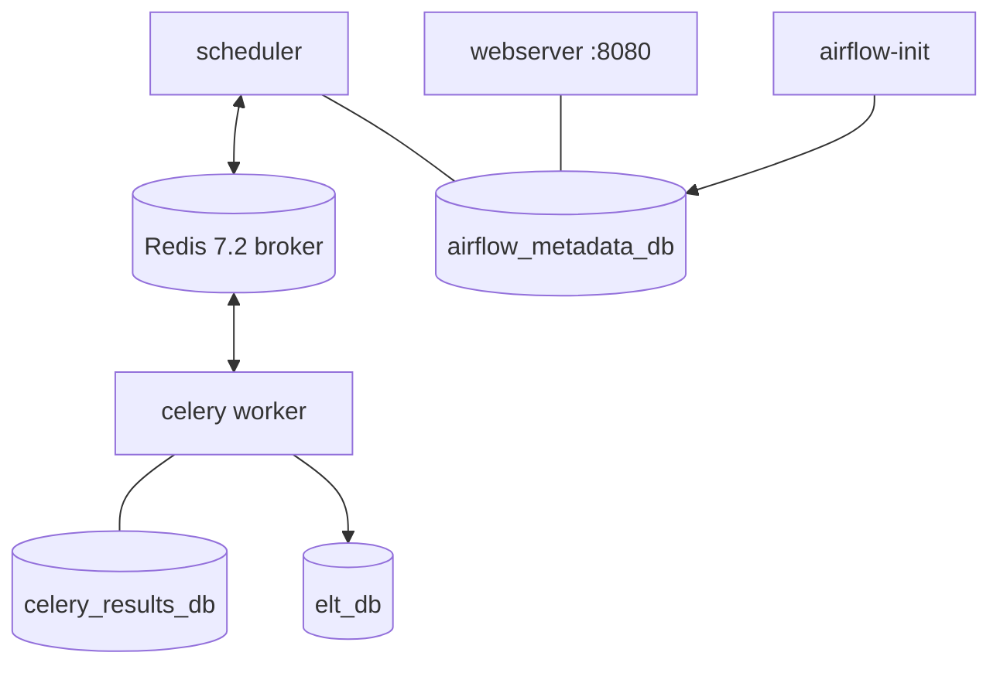

# YT_ELT

An ELT pipeline for YouTube channel statistics. It pulls every video from a
channel's uploads playlist via the **YouTube Data API v3**, extracts per-video
metrics, and is being built out to load them into Postgres on a schedule under
**Apache Airflow**.

---

## Project status

Read this first — the repository contains more infrastructure than the pipeline
currently uses.

| Part | State |
|---|---|
| `video_stats.py` — extract + JSON output | Working. Runs standalone on the host. |
| Airflow stack (`docker-compose.yaml`, `Dockerfile`) | Scaffolding. Builds, but no DAGs exist yet. |
| `dags/` | Not created. The extract has never run as an Airflow task. |
| Load into Postgres | Not built. The `L` in ELT is still a JSON file. |
| Transforms / tests | Not built. |

So today this is an **E**, not an ELT. The compose stack is there so the team can
stand up Airflow and move the script into it — see
[AIRFLOW.md](AIRFLOW.md) §9, "Turning THIS repo into a DAG".

---

## Architecture

### What runs today


A single script on the host, reading credentials from `.env` via `python-dotenv`.
It calls three endpoints in sequence: `channels`, then `playlistItems` paged 50
at a time, then `videos` batched 50 at a time.

### What the compose stack provides



One Postgres 13 container hosts **three separate databases**, each with its own
user, created on first startup by
`docker/postgres/init-multiple-databases.sh`:

| Database | Purpose |
|---|---|
| `airflow_metadata_db` | Airflow's own state — DAG runs, task instances |
| `celery_results_db` | Celery result backend for task outcomes |
| `elt_db` | **The actual data warehouse** — where YouTube data will land |

Keeping them separate means a metadata reset never touches pipeline data.
AIRFLOW.md explains the reasoning in depth.

---

## Repository layout

```text
video_stats.py            Extract script — the whole pipeline, for now
docker-compose.yaml       Airflow CeleryExecutor stack
Dockerfile                Airflow image + this project's dependencies
docker/postgres/          Postgres init script (creates the 3 databases)
data/logs/                Script output; gitignored except one sample
.env.example              Every variable the stack reads — copy to .env
AIRFLOW.md                Airflow training guide for new joiners
requirements.txt          Python dependencies
```

---

## Quick start — run the script directly

This is the fastest path and needs no Docker. Python 3.10+ (built on 3.14.6).

```cmd
python -m venv venv
venv\Scripts\activate.bat
python -m pip install --upgrade pip
python -m pip install -r requirements.txt
```

Then configure credentials:

```cmd
copy .env.example .env
```

Only three values matter for the script:

```dotenv
API_KEY=your-youtube-data-api-key
YT_URL=https://youtube.googleapis.com/youtube/v3
CHANNEL_HANDLE=naveenautomationlabs
```

`API_KEY` comes from Google Cloud Console with **YouTube Data API v3** enabled.
`CHANNEL_HANDLE` has no leading `@`. All three are read at startup and the script
exits immediately if any is missing (`video_stats.py:17`).

```cmd
python video_stats.py
```

Everything else in `.env.example` belongs to the containerised stack and is not
needed here.

---

## What the script does

1. **Resolve the uploads playlist** — `GET /channels?forHandle=...` returns the
   channel's uploads playlist ID.
2. **Page through the playlist** — `GET /playlistItems`, 50 at a time, following
   `nextPageToken` until exhausted. Logs progress per page.
3. **Fetch statistics in batches** — `GET /videos` with up to 50 comma-separated
   IDs per call, requesting `contentDetails`, `snippet` and `statistics`.
4. **Write JSON** — `data/logs/yt_stats_<timestamp>.json`.

Each record:

```json
{
    "video_id": "dQw4w9WgXcQ",
    "title": "Example video",
    "published_at": "2024-01-15T10:00:00Z",
    "duration": "PT12M34S",
    "view_count": "15234",
    "like_count": "421",
    "comment_count": "37"
}
```

`duration` is ISO 8601, and the three counts come back from the API as
**strings**, defaulting to `0` when a video hides them. Both are worth
normalising in the load step.

### API quota

The YouTube Data API allows 10,000 units/day by default. A run of this script
costs roughly one unit per API call — about 17 for a 400-video channel — so
quota is not a practical concern at this scale.

---

## Running the Airflow stack

> **See "Known issues" below before you spend time on this** — the compose file
> and the Dockerfile currently disagree about the Airflow version.

```cmd
docker compose up -d
```

The UI is at `http://localhost:8080`, credentials from
`AIRFLOW_WWW_USER_USERNAME` / `AIRFLOW_WWW_USER_PASSWORD`. Postgres is published
on `5432`.

Set `AIRFLOW_UID` before first start: on Linux/WSL use `id -u`; on Windows or
macOS Docker Desktop leave it at `50000`. Getting it wrong leaves root-owned
files in the mounted volumes.

New to Airflow? Start with [AIRFLOW.md](AIRFLOW.md) — it assumes no prior data
engineering background and covers this stack specifically.

---

## Environment variables

Full reference with comments lives in `.env.example`. Grouped by what reads them:

| Group | Variables | Read by |
|---|---|---|
| YouTube API | `API_KEY`, `YT_URL`, `CHANNEL_HANDLE` | `video_stats.py` via `os.getenv()` |
| DockerHub image | `DOCKERHUB_NAMESPACE`, `DOCKERHUB_REPOSITORY`, `IMAGE_TAG` | compose, to resolve the image |
| Postgres superuser | `POSTGRES_CONN_{USERNAME,PASSWORD,HOST,PORT}` | Postgres container, init script |
| Metadata DB | `METADATA_DATABASE_{NAME,USERNAME,PASSWORD}` | Airflow's SQLAlchemy connection |
| Celery backend | `CELERY_BACKEND_{NAME,USERNAME,PASSWORD}` | Celery result backend |
| ELT DB | `ELT_DATABASE_{NAME,USERNAME,PASSWORD}` | `AIRFLOW_CONN_POSTGRES_DB_YT_ELT` |
| Airflow | `AIRFLOW_UID`, `AIRFLOW_WWW_USER_*`, `FERNET_KEY` | Airflow itself |

**`.env` is gitignored and must never be committed.** `FERNET_KEY` encrypts
connections and variables at rest — changing it makes existing encrypted values
unreadable.

### Why `API_KEY` appears twice in compose

The environment block sets both `AIRFLOW_VAR_API_KEY` and a plain `API_KEY`
(same for `CHANNEL_HANDLE` and `YT_URL`). They serve different readers:

- `AIRFLOW_VAR_*` is the prefix Airflow requires for `Variable.get()`.
- The plain name is what `os.getenv()` in `video_stats.py` actually reads today.

The duplication matters because `env_file: .env` is meant to be switched off for
GitHub Actions (noted at `docker-compose.yaml:52`). Without the plain copies,
the script's three variables would vanish on that path.

---

## Known issues

**1. Compose targets Airflow 2, the image is Airflow 3.** The `Dockerfile` pins
`AIRFLOW_VERSION=3.2.2`, but `docker-compose.yaml` is derived from the Airflow
2.9.2 template and still uses `command: webserver` (`docker-compose.yaml:168`).
That command does not exist in Airflow 3 — it is now `api-server`
(AIRFLOW.md:508). Airflow 3 also expects a separate `dag-processor` component
that the stack does not define. Expect the webserver service to fail until the
compose file is migrated (AIRFLOW.md §16 is the 2→3 cheat sheet) or the image is
pinned back to 2.9.2. **Not yet fixed — the direction needs deciding first.**

**2. `data/logs/` is gitignored.** One sample run is committed for reference;
everything else is ignored. Don't expect your output to show up in `git status`.

**3. Line endings.** `.gitattributes` forces LF for `*.sh`, the Dockerfile and
the compose file. Without it, a Windows checkout would hand a CRLF script to
`docker-entrypoint-initdb.d` and Postgres init would fail with
`bad interpreter: /bin/bash^M`.

---

## Team conventions

- **Commits go straight to `main`.** No feature branches on this repo.
- **Never commit `.env`.** Add new variables to `.env.example` with a
  `<placeholder>` value so the next person knows they exist.
- **Keep `.env.example` and `docker-compose.yaml` in sync.** Every `${VAR}` in
  compose should have a matching key in the example file.
